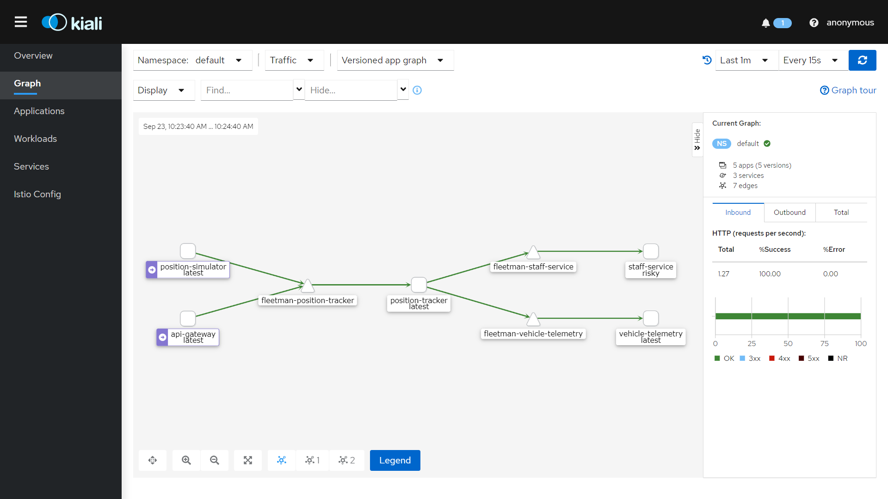
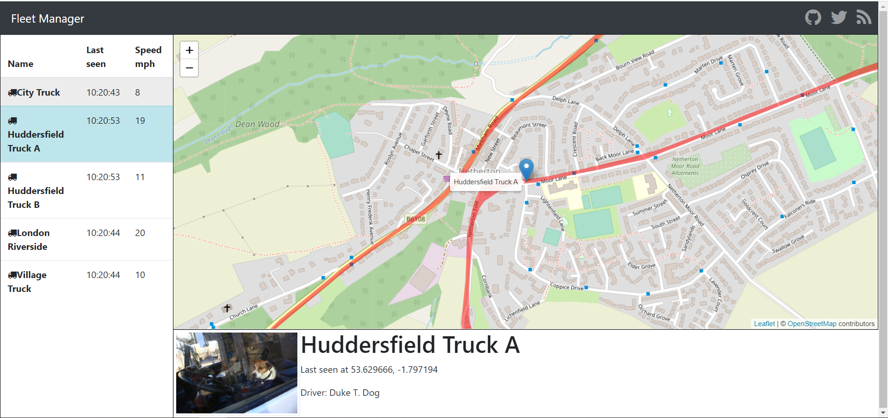
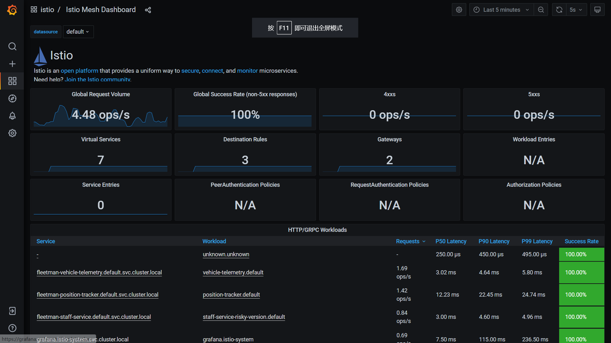
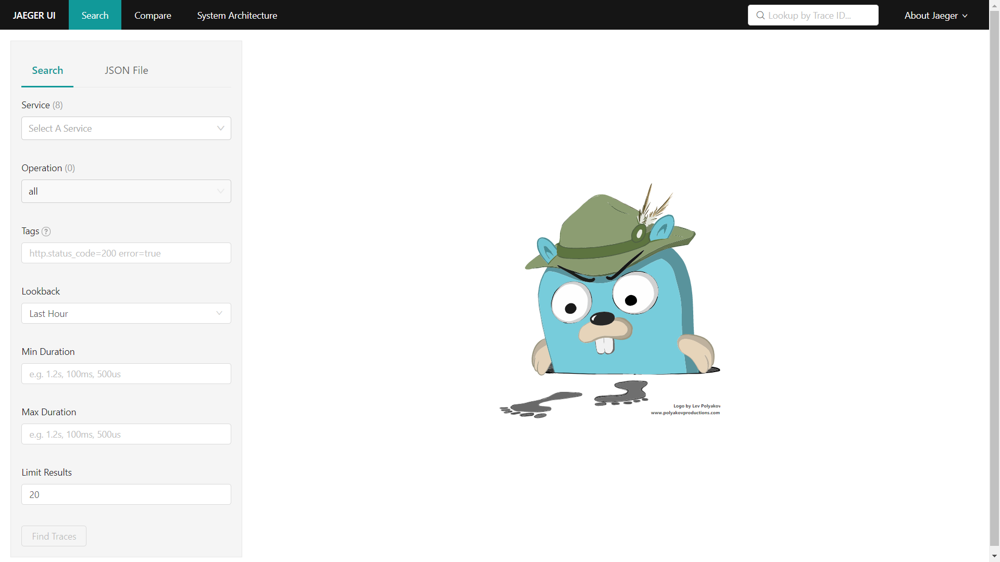

## Deploy micro-service applications on k8s cluster using istio

> Keywords: k8s, Istio, jaeger, grafana, kiali, micro-service





This repo contains configurations for deploying micro-service applications on a k8s cluster with auto-generated TLS certificate.

```
$ kubectl get no
NAME                                       STATUS   ROLES    AGE     VERSION        
gke-cluster-1-default-pool-ff62b101-8lbw   Ready    <none>   2d22h   v1.20.9-gke.701
gke-cluster-1-default-pool-ff62b101-dkz7   Ready    <none>   2d22h   v1.20.9-gke.701
gke-cluster-1-default-pool-ff62b101-fr7l   Ready    <none>   2d22h   v1.20.9-gke.701
```


### 0. TLDR;

In total, 6 commands are required to set up everything.

```
$ istioctl install --set profile=demo -y
$ kubectl apply -f 1-label-default-namespace.yaml
$ kubectl apply -f 2-application-no-istio.yaml
$ kubectl apply -f 3-http-apps.yaml
$ kubectl apply -f https://github.com/jetstack/cert-manager/releases/download/v1.5.3/cert-manager.yaml
$ kubectl apply -f 4-https-apps.yaml
```


### 1. Install Istio

Istio can be installed using istioctl, which can be downloaded on the github release page:

https://github.com/istio/istio/releases (e.g. [istio-1.11.2-win.zip](https://github.com/istio/istio/releases/download/1.11.2/istio-1.11.2-win.zip))

```
istioctl install --set profile=demo -y
```

Now we can enable istio for the default namespace:

```
kubectl apply -f 1-label-default-namespace.yaml
```

You should see 3 pods up and running under the istio-system namespace:

```
$ kubectl get po -n istio-system
NAME                                    READY   STATUS    RESTARTS   AGE  
istio-egressgateway-6c9486d667-f2fwh    1/1     Running   0          43h  
istio-ingressgateway-556bd8b675-gbjmj   1/1     Running   0          43h  
istiod-96b47b576-kkqc2                  1/1     Running   0          43h  
```

We can install some add-ons such as Grafana, Kiali, Jaeger.

```
$ cd istio-1.11.2/samples/addons
$ kubectl apply -f kiali.yaml
$ kubectl apply -f grafana.yaml
$ kubectl apply -f jaeger.yaml
```

Now we should see:

```
$ kubectl get po -n istio-system
NAME                                    READY   STATUS    RESTARTS   AGE
grafana-556f8998cd-gwdz4                1/1     Running   0          42h
istio-egressgateway-6c9486d667-f2fwh    1/1     Running   0          43h
istio-ingressgateway-556bd8b675-gbjmj   1/1     Running   0          43h
istiod-96b47b576-kkqc2                  1/1     Running   0          43h
jaeger-5f65fdbf9b-gpjmq                 0/1     Evicted   0          42h
jaeger-5f65fdbf9b-h4bgq                 0/1     Evicted   0          10h
jaeger-5f65fdbf9b-n842n                 0/1     Evicted   0          31h
jaeger-5f65fdbf9b-njgjz                 0/1     Evicted   0          22h
jaeger-5f65fdbf9b-qnmfr                 0/1     Evicted   0          16h
jaeger-5f65fdbf9b-twl8m                 1/1     Running   0          4h20m
kiali-787bc487b7-vtgh6                  1/1     Running   2          42h
prometheus-9f4947649-7q56n              2/2     Running   0          42h
```


### 2. Deploy Apps

The micro-service applications can be deploy using:

```
kubectl apply -f 2-application-no-istio.yaml
```


### 3. Deploy Gateway

Finally, we can deploy the gateway (both https and http):

```
kubectl apply -f 3-http-apps.yaml
```

Now the apps are available at (replace domain names  with yours in the yaml file):

```
http://app.wuhanstudio.uk
http://grafana.wuhanstudio.uk
http://jaeger.wuhanstudio.uk

# Due to known bugs, kiali is not accessible using the gateway 
# Here I use a LoadBalancer by changing kiali.yaml
http://kiali.wuhanstudio.uk
```

In the next step, let's install cert-manager to generate TLS certificate automatically:

```
kubectl apply -f https://github.com/jetstack/cert-manager/releases/download/v1.5.3/cert-manager.yaml
```

And we can generate TLS certification automatically using:

```
kubectl apply -f 4-https-apps.yaml
```

If everything works fine, we have https applications available:

```
https://app.wuhanstudio.uk
https://grafana.wuhanstudio.uk
https://jaeger.wuhanstudio.uk
```





### Conclusion

We should see two gateways and several virtual services, as well as certificates:

```
$ kubectl get gateway
NAME            AGE
http-gateway    25m
https-gateway   31m
```

```
$ kubectl get vs
NAME               GATEWAYS            HOSTS                    AGE
fleetman-webapp    ["http-gateway"]    ["app.wuhanstudio.uk"]   25m
fleetman-webapps   ["https-gateway"]   ["app.wuhanstudio.uk"]   30m
```

```
$ kubectl get vs -n istio-system
NAME              GATEWAYS                    HOSTS                        AGE
grafana-webapp    ["default/http-gateway"]    ["grafana.wuhanstudio.uk"]   25m
grafana-webapps   ["default/https-gateway"]   ["grafana.wuhanstudio.uk"]   31m
jaeger-webapp     ["default/http-gateway"]    ["jaeger.wuhanstudio.uk"]    25m
jaeger-webapps    ["default/https-gateway"]   ["jaeger.wuhanstudio.uk"]    31m
```

```
$ kubectl get certificate -n istio-system
NAME                     READY   SECRET                       AGE
app-wuhanstudio-uk       True    app-wuhanstudio-uk-tls       31m
grafana-wuhanstudio-uk   True    grafana-wuhanstudio-uk-tls   31m
jaeger-wuhanstudio-uk    True    jaeger-wuhanstudio-uk-tls    31m
```

